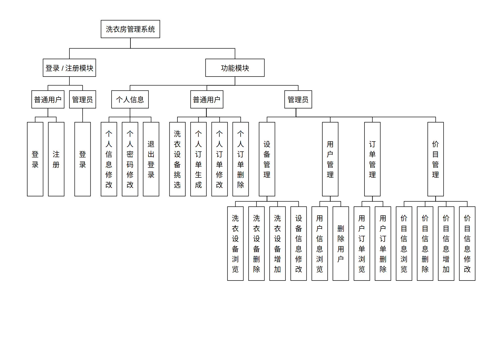

# LaundryManagementSystem

洗衣房管理烂系统

### 1. 开发、环境要求及说明

数据的具体设计见[mysql.sql](./mysql.sql)。

#### 1.1 本项目主要开发工具和环境：

* Tomcat 9
* Eclipse IDE 2020-09
* OpenJDK 11.0.9
* mariadb  Ver 15.1 Distrib 10.3.25-MariaDB or MySQL Version<8

#### 1.2 分包结构

* dao: 操作数据库
* entity: 实体模型
* controller: 用于处理页面,主要是Servlet
* utils: 数据库连接工具
* filter: 拦截器
* tag: 自定义标签工具包
* service: 后台服务

#### 1.3 系统模块图

#### 1.4 功能说明

* 普通用户不能看到被别人选中的洗衣机；

* 管理员不能删除已被选中的洗衣机，如果要删除，先手动删除对应的订单；

* 管理员不可以增改用户个人信息，不可以增改订单内容，只允许删除用户或订单；

* 如果管理员删除某一用户，相应的订单也会被自动删除；

* 如果管理员删除或修改某一价目，对应价目的所有订单会被自动删除。